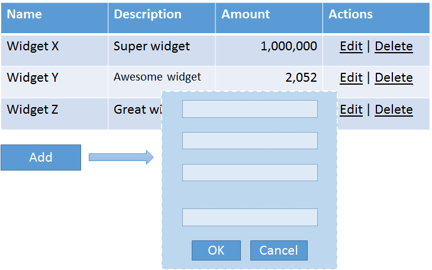
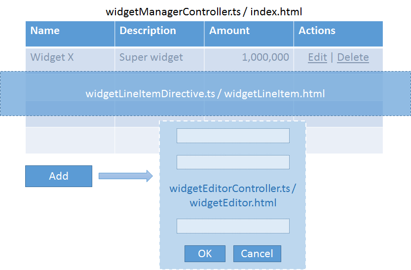

The purpose of this article is to
1. Provide a working guidance on building AngularJS applications using TypeScript and powered by ASP.NET vNext backend.
2. Experiment with building web applications using facilities provided by and mindset required by [Visual Studio Code](https://code.visualstudio.com/).

## As seen on CodeProject

This [article was published on CodeProject](http://www.codeproject.com/Articles/1019920/Building-AngularJS-application-with-TypeScript-and) before appearing on this blog.

## What are we building?
In order to showcase a few things possible with AngularJS and how these things translate into TypeScript, we'll be building a simple, yet not too simple application for managing widgets.
Our application will showcase a list of widgets and users will be able to add, edit and delete widgets, all that possible while staying on the same page. The application is pretty simple,
yet it has enough features to show many parts on AngularJS in one app, working together, instead of focusing only one thing like most tutorials do.

At the same time we'll be building all that in Visual Studio Code and we'll touch a lot of tooling questions and issues around it. 



## Development environment configuration
Coming from fully featured Visual Studio IDE, it's very easy to get lost in all the multiple ways you can approach your development environment configuration. There's no installer package
that will allow you to select a bunch of options and then watch a progress bar going through the installation progress. Each part of your toolchain is coming from a different source,
has its own way of configuration, running, etc. This configuration needs to be done only once and you will be able to use it over and over again for other projects.

Tools that we need:
1. [NodeJS](https://nodejs.org/)
2. NPM and following modules installed globally:
  * bower
  * gulp
  * gulp-watch
  * gulp-cli
  * gulp-typescript
  * yo
  * generator-aspnet
  * typescript
  * tsd
3. [DNX](https://github.com/aspnet/dnx)
4. [Visual Studio Code](https://code.visualstudio.com/)

You may download/install them manually, or -- as I prefer it -- use [0-to-code installer](https://github.com/wasker/0-to-code) that installs these and a better console and git, thus giving you 
pretty much all you need when you're developing with Visual Studio Code. In addition to installing all the tools, this installer will configure your user environment properly, putting
all commands that you need in proper places.

If you are not familiar with package management aside from NuGet, you may find article 
["Package Managers: An Introductory Guide for the Uninitiated Front-End Developer"](http://codylindley.com/techpro/2013_04_12__package-managers-an-introducto/) educational.

## Minimal ASP.NET application
In regular Visual Studio the process of creating a new project was as easy as selecting File -> New command in the menu. After initial development environment configuration, you'll be
able to do that pretty much as easy as that, except using the command line.

```
yo aspnet --gulp
```

The command above will prompt you for a type of application (choose "Web Application Basic") and the location of said application. After completing the prompt, you'll be presented with the 
cookie-cutter ASP.NET vNext application. Since ```--gulp``` argument was specified, our project will be using [Gulp](https://github.com/gulpjs/gulp/blob/master/docs/README.md#articles) as a build system. 

Your next steps:

```
dnu restore & bower install & npm install

dnu build
```

Now, if you type ```code .``` in your command prompt, you should be able to edit your code with Visual Studio. In order to run your application, press Ctrl-Shift-P and type ```dnx web```. This
will start a local web server and you'll be able to navigate to http://localhost:5000 and use your application.

[This stage in repository](https://github.com/wasker/0-to-code-sample/tree/4d21752703a44e84e723e34e29bceb15d39dda1a)

### Add AngularJS to application
When web application is developed in a Visual Studio IDE, all details of how it is served when you run it via F5, are hidden from you by the IDE. Usually you start dealing
with all these questions when you are ready to deploy. When you develop with Visual Studio Code, the acquisition and deployment of assets questions are posed right from the
beginning of the project. In order to get started with AngularJS we'll need to specify where to get it, and, more importantly, where to put it.

1. Edit ```bower.json``` and add:
  * "angular": "1.4.0"
  * "angular-ui-router": "0.2.15"
  * "angular-bootstrap": "0.13.0"
2. Run ```bower install``` command and observe that it downloads three packages you've just added to ```bower.json```.
3. Include Angular code in your page by adding links to the Angular scripts in ```Views\Shared\_Layout.cshtml```:
  ```
  <script src="~/lib/angular/angular.min.js"></script>
  <script src="~/lib/angular-ui-router/release/angular-ui-router.min.js"></script>
  <script src="~/lib/angular-bootstrap/ui-bootstrap-tpls.min.js"></script>
  ```
4. Start your application and observe that Angular code is being downloaded to client.

[This stage in repository](https://github.com/wasker/0-to-code-sample/tree/1d644028da4a33a385ea433896059ad61e408544)

### Add TypeScript support to application
We will be using exclusively TypeScript for further application development. Following steps will configure our build pipeline to compile all our TypeScript code to one
output JavaScript file, using type definition files for external libraries like jQuery and Angular. The build pipeline will also generate sourcemap files to make our 
debugging easier.

1. Create folder ```scripts```. This will be an input folder for our TypeScript compilation task.
2. Edit ```package.json``` and add:
  * "gulp-typescript": "2.8.0"
  * "gulp-sourcemaps": "1.5.2"
3. Run ```npm install``` and observe that newly added packages are downloaded locally.
4. Edit ```gulpfile.js```:
  1. At the start of the file add:
    * tsc = require("gulp-typescript")
    * sourcemaps = require("gulp-sourcemaps")
  2. Find the "paths" structure definition and add following folders there:
    *  appScripts: "./scripts/"
    *  typings: "./typings/"
  3. Under the "paths" structure make following changes
    ```
	paths.appOut = paths.webroot + "js/";
	paths.appSources = paths.appScripts + "**/*.ts";
	paths.js = paths.appOut + "**/*.js";
    ```
  4. Create new task "compile-app":
    ```
	gulp.task("compile-app", function () {
	  var tscResult = gulp.src([paths.appSources, paths.typings + "**/*.d.ts"])
	                    .pipe(sourcemaps.init())
	                    .pipe(tsc({
	                      target: "ES5",
	                      removeComments: true,
	                      noImplicitAny: true,
	                      noEmitOnError: true,
	                      noExternalResolve: true,
	                      out: "app.js"
	                    }));  
	
	  return tscResult.js
	          .pipe(sourcemaps.write("maps/"))                  //  Relative to paths.js.
	          .pipe(gulp.dest(paths.js));
	});
	```
  5. Create ```scripts\app.ts```:
    ```
	let hello = "world";
	alert(hello);
    ```
  6. Include link to ```app.js``` in ```Views\Home\Index.cshtml```:
	```
	@section scripts 
	{
	<script src="~/js/app.js"></script>
	}
	```
  7. In order to prevent VSCode from interpreting TypeScript files and generated JavaScript files together, create ```jsconfig.json``` 
  	in the root folder of the project.
	```
	{
		"exclude": [
			"wwwroot"
			, "node_modules"
		]
	}
	```

After you did that, you should be able to successfully execute ```gulp compile-app``` from the command prompt and then run the application.

[This stage in repository](https://github.com/wasker/0-to-code-sample/tree/265092dc9441bd6dde45177912da8796c948d2d0)

### Implement barebones AngularJS application
Now that we have all building blocks in place, we can easily implement a barebones AngularJS application that does nothing.

1. Under the ```scripts``` folder create ```controllers```, ```directives```, ```services``` and ```templates``` folders. Our application's implementation will be spread around these folders.
2. From the command line run ```tsd install jquery angular angular-ui-bootstrap angular-ui-router```. This will install TypeScript type definitions for jQuery and Angular.
3. Edit ```gulpfile.js```:
	1. Find the "paths" structure definition and add following folders there:
	  	*  templates: "./scripts/templates/"
	2. Under the "paths" structure define a new variable
	```
	paths.templatesOut = paths.webroot + "templates/"
	paths.templateFiles = paths.templates + "**/*.html";
	```
	3. Create new task "copy-templates":
		```
		gulp.task("copy-templates", function () {
		  gulp.src(paths.templateFiles)
		    .pipe(gulp.dest(paths.templatesOut));
		});
		```
4. Create ```scripts\appTypes.d.ts``` (see below).
5. Create ```scripts\app.ts``` (see below).
6. Create ```scripts\Templates\index.html``` that has some placeholder text.
7. Find ```body-content``` container in ```Views\Shared\_Layout.cshtml``` and add our app declaration as shown below:
	```
    <div class="container body-content" ng-app="widgetRegistryApp">
        @RenderBody()
    </div>
	```
8. Modify ```Views\Home\Index.cshtml``` to bootstrap the application (see below).
9. Run ```gulp compile-app``` to compile the application, then ```gulp copy-templates``` to copy templates from their original location to the output folder under wwwroot.
10. You should be able to start your application and see the placeholder text displayed on the webpage.

#### Application types
To keep things simple, we'll keep all type definitions related to our application in one file. All our modules will have to reference only this file and maybe some
other modules that are specific only for the module in question.

Create ```scripts\appTypes.d.ts``` with the contents below.
```
/// <reference path="../typings/angularjs/angular.d.ts" />
/// <reference path="../typings/angular-ui-bootstrap/angular-ui-bootstrap.d.ts" />

declare namespace WidgetRegistry {
	/** Application module name. */
	var appModuleName: string;

	/** Application configuration. */	
	interface AppConfig {
		/** API endpoint. */
		apiEndpoint: string;

		/** Directory that contains templates. */		
		templateRoot: string;
	}
}

declare module angular {
	interface IScope {
		/**
		 * Constructs full path to template.
		 * @param fileName Template file name without path.
		 */
		pathToTemplate: (fileName: string) => string;
	}
}
``` 

Our type definitions include general Angular type definitions and declare our application's module name and configuration interface. We also add our utility method 
on Angular's scope definition.

#### Application module
Application module defines and configures our application. Things like routing configuration are happening there.

Modify ```scripts\app.ts``` as follows:
```
/// <reference path="appTypes.d.ts" />
/// <reference path="../typings/angular-ui-router/angular-ui-router.d.ts" />

namespace WidgetRegistry {

	//	Configure application module name.	
	appModuleName = "widgetRegistryApp";

	//	Create application module.	
	var app = angular.module(appModuleName, ["widgetRegistryData", "ui.router", "ui.bootstrap"]);

	//	Configure application module.	
	app.config(["appConfig", "$stateProvider", "$urlRouterProvider", function (appConfig: AppConfig, $stateProvider: ng.ui.IStateProvider, $urlRouterProvider: ng.ui.IUrlRouterProvider) {
		$stateProvider
			.state("root", {
				url: "/",
				templateUrl: getPathToTemplate(appConfig, "index.html")
			});

		$urlRouterProvider.otherwise("/");
	}]);

	//	Initialize application module.	
	app.run(["appConfig", "$rootScope", function(appConfig: AppConfig, $rootScope: ng.IRootScopeService) {
		//	Expose global functions on root scope.
		(<ng.IScope>$rootScope).pathToTemplate = (fileName: string) => getPathToTemplate(appConfig, fileName);
	}]);

	/**
	 * Constructs full path to template.
	 * @param appConfig Application configuration. 
	 * @param fileName Template file name without path.
	 */	
	function getPathToTemplate(appConfig: AppConfig, fileName: string): string {
		return appConfig.templateRoot + fileName;
	}

}
``` 
Note that our application explicitly refers to Angular UI router's type definitions. This is because UI router is not used anywhere else and it's not useful
to have its definitions visible in other places.

The application configures its global module name, declares dependencies to our data module (below) and configures routing to show our dummy template.

#### Bootstrap application module on the webpage
One final step is to actually bootstrap our application. Modify ```Views\Home\Index.cshtml``` as follows:

```
@{
    ViewBag.Title = "Home Page";
}

@section scripts
{

<script type="text/javascript">

	var appData = angular.module("widgetRegistryData", []);

    var appConfig = {
        apiEndpoint: "/api/widgets/",
		templateRoot: "/templates/"
    };
	appData.constant("appConfig", appConfig);

</script>

<script src="~/app/app.js"></script>

}

<div ui-view></div>
```

All this view does is it declares our data module that contains actual application configuration (you might want to pass current values from the model instead
of hardcoding them), refers to an application script bundle and declares where the application view will be located.

[This stage in repository](https://github.com/wasker/0-to-code-sample/tree/266c7109efe30db750cdfbd6009e1558849bc0e1)

## Building blocks

Before we move on to implementation, let's take a high-level look at which blocks our toy application consists of. 



The main view of our application lists all widgets, allows user to modify widgets on the list and add new widgets. This functionality will be orchestrated by
the ```widgetManagerController.ts``` controller that will power ```index.html``` template.

As you can see from the diagram, each line item on the list not just displays the information about the widget, but also allows editing or deleting a widget. It
makes more sense to extract all that functionality into a separate class, which we'll do by introducing ```widgetLineItem.html``` template backed by 
the ```widgetLineItemDirective.ts``` directive.

Finally, whenever the user clicks Add button or Edit link on the widget line item, an editor opens. This functionality is implemented in the ```widgetEditorController.ts```
controller and exposed to user via the ```widgetEditor.html``` template.

We will provide communication with the backend via the ```widgetService.ts``` service.

## Implementation details

### Widget types

All our functionality will be speaking in terms of "widgets". Since we're working in TypeScript universe, let's describe widget types.

First, create ```scripts\widgetState.ts```:

```
namespace WidgetRegistry {

	/** States of the widget. */	
	export enum WidgetState {
		existing = 0,
		new = 1,
		deleting = 2,
		deleted = 3,
		undeleting = 4
	}

}
```

Then modify ```scripts\appTypes.d.ts```:

```
/// <reference path="widgetState.ts" />

/** Widget data. */	
interface Widget {
	/** Widget ID. */
	id: string;

	/** Widget name. */		
	name: string;

	/** Some amount. */		
	amount: number;

	/** Widget description. */		
	description?: string;

	/** Private state of widget. */		
	$state?: WidgetState;
}

type WidgetList = Array<Widget>;
```

The types are self-explanatory. ```WidgetState``` is a way for us to keep track of the widget state on client. The ```$state``` member will never be taken to account by 
the server side. 

### Service stub

Pretty much all our functionality will be calling the backend to perform some kind of operation on the widget. AngularJS provides AJAX functionality via ```$http``` service.
You may choose to make all controllers to be dependent on this service and perform HTTP operations, that correspond to backend calls, directly, however, the more elegant way 
would be to define our own service that exposes backend functionality in terms that make sense for our application problem domain. This way you may change the actual service 
implementation later on, or mock specific service operations instead of handling generic GET/POST/etc. verbs in unit tests.

First off, let's define the service interface (```appTypes.d.ts```).

```
/** Backend service operations. */	
interface IWidgetService {
	/** Gets list of widgets. */
	getWidgets(): ng.IPromise<WidgetList>;

	/**
	 * Creates new widget.
	 * @param widget Widget to be created.
	 */		
	createWidget(widget: Widget): ng.IPromise<any>;

	/**
	 * Updates an existing widget.
	 * @param widget Widget to be updated.
	 */		
	updateWidget(widget: Widget): ng.IPromise<any>;

	/**
	 * Deletes an existing widget.
	 * @param widget Widget to be deleted.
	 */		
	deleteWidget(widget: Widget): ng.IPromise<any>;

	/**
	 * Restores a widget that was deleted earlier.
	 * @param widget Widget to be restored.
	 */		
	undoWidgetDelete(widget: Widget): ng.IPromise<any>;
}
```

At this stage of our app development, it's too early to provide an actual implementation of the service, so let's fake it by using Angular's ```$q``` service 
in ```scripts\services\widgetService.ts```.

```
/// <reference path="../appTypes.d.ts" />

namespace WidgetRegistry {

	/** Backend service communications. */	
	export class WidgetService implements IWidgetService {
		//	Dependencies.
		public static $inject = ["appConfig", "$q"];

		constructor(
			private appConfig: AppConfig,
			private promise: ng.IQService) {
		}

		/** Part of IWidgetService. */		
		public getWidgets = (): ng.IPromise<WidgetList> => {
			var operation = this.promise.defer();
			operation.resolve([{
				id: "widget_1",
				name: "Some widget",
				amount: 100,
				description: "This is the best widget ever"
			}]);
			
			return operation.promise;
		}

		/** Part of IWidgetService. */		
		public createWidget = (widget: Widget): ng.IPromise<any> => {
			var operation = this.promise.defer();
			operation.resolve();
			
			return operation.promise;
		}

		/** Part of IWidgetService. */		
		public updateWidget = (widget: Widget): ng.IPromise<any> => {
			var operation = this.promise.defer();
			operation.resolve();
			
			return operation.promise;
		}

		/** Part of IWidgetService. */		
		public deleteWidget = (widget: Widget): ng.IPromise<any> => {
			var operation = this.promise.defer();
			operation.resolve();
			
			return operation.promise;
		}

		/** Part of IWidgetService. */		
		public undoWidgetDelete = (widget: Widget): ng.IPromise<any> => {
			var operation = this.promise.defer();
			operation.resolve();
			
			return operation.promise;
		}
	}

	//	Register with application module.	
	angular.module(appModuleName).service("widgetService", WidgetService);

}
```

Later, once we're ready, we'll replace stubs with actual calls to the backend. 

### Widget manager controller

Controllers in Angular power actual functionality exposed to users through templates. Each controller has its scope. Different people approach controller 
scopes differently. I prefer to split scope members into the model and operations, and make controllers expose both explicitly, as opposed to treating the 
controller itself as a view-model and accessing it directly from the view. Here's how I define the widget manager controller (```appTypes.d.ts```).

```
type EventCallback = (e?: ng.IAngularEvent) => void;

/** Scope of the widget manager. */	
interface WidgetManagerScope extends ng.IScope {
	/** Widget manager model. */
	model: {
		/** List of widgets. */
		widgets: WidgetList;

		/** Indicates whether the operation is in progress. */		
		operationInProgress: boolean;

		/** If operation results in an error, contains a message. */
		errorMessage?: string;			
	}

	/** Initiates operation of adding a new widget. */		
	addWidget: EventCallback;		

	/** 
	 * Edits widget.
	 * @param widget Widget to be edited.
	 */		
	editWidget(widget: Widget): void;

	/** 
	 * Deletes widget.
	 * @param widget Widget to be deleted.
	 */		
	deleteWidget(widget: Widget): void;

	/** 
	 * Restores widget that was deleted.
	 * @param widget Widget to be restored.
	 */		
	undeleteWidget(widget: Widget): void;
}
```

The implementation of the controller will live in ```scripts\controllers\widgetManagerController.ts``` and look like this.

```
/// <reference path="../appTypes.d.ts" />

namespace WidgetRegistry {

	/** Widget manager controller. */	
	export class WidgetManagerController {
		/** Dependencies. */
		public static $inject = ["appConfig", "$scope", "widgetService"];

		constructor(
			private appConfig: AppConfig,
			private $scope: WidgetManagerScope,
			private widgetService: IWidgetService) {

			$scope.model = {
				widgets: [],
				operationInProgress: false
			};
			$scope.addWidget = this.addWidget;
			$scope.editWidget = this.editWidget;
			$scope.deleteWidget = this.deleteWidget;
			$scope.undeleteWidget = this.undeleteWidget;

			this.performOperation(this.widgetService.getWidgets()
				.then((widgets: WidgetList) => this.$scope.model.widgets = widgets)
				.catch(() => this.$scope.model.errorMessage = "Cannot get list of widgets. Please try again later."));
		}

		/** Wraps an operation with operationInProgress indicator. */		
		private performOperation = (operationPromise: ng.IPromise<any>): void => {
			this.$scope.model.operationInProgress = true;
			this.$scope.model.errorMessage = "";

			operationPromise.finally(() => this.$scope.model.operationInProgress = false);
		}

		/** Part of WidgetManagerScope. */		
		private addWidget = (): void => {
		}

		/** Part of WidgetManagerScope. */		
		private editWidget = (widget: Widget): void => {
		}

		/** Part of WidgetManagerScope. */		
		private deleteWidget = (widget: Widget): void => {
		}

		/** Part of WidgetManagerScope. */		
		private undeleteWidget = (widget: Widget): void => {
		}
	}

	//	Register with application module.	
	angular.module(appModuleName).controller("widgetManagerController", WidgetManagerController);

}
```

The constructor of our controller initializes the scope with an empty model, exposes widget operations that user will invoke by clicking the elements
of our user interface, and schedules an operation to retrieve the list of widgets from the backend. Since our service implementation is stubbed, it 
will return immediately, but due to us stubbing it through the ```$q``` service, the controller logic that receives the list of widgets will not change
later, when we move on to a proper implementation. 

Now we can replace our dummy ```index.html``` template with markup like shown below.

```
<div class="alert alert-danger" ng-if="model.errorMessage">
	{{model.errorMessage}}
</div>

<div class="table-responsive">

	<table class="table table-striped">

	  <thead>
	    <tr>
	      <th>ID</th>
	      <th>Name</th>
	      <th>Amount</th>
	      <th>Description</th>
	      <th>&nbsp;</th>
	    </tr>
	  </thead>

	  <tbody>
	    <tr ng-repeat="widget in model.widgets">
			<td>{{widget.id}}</td>
			<td>{{widget.name}}</td>
			<td>{{widget.amount}}</td>
			<td>{{widget.description}}</td>
			<td>Edit&nbsp;|&nbsp;Delete</td>
		</tr>
	  </tbody>

	</table>

</div>

<div class="row">

	<div class="col-xs-12">

		<button id="add-widget" 
				ng-click="addWidget()" 
				ng-disabled="model.operationInProgress">Add</button>

	</div>
	
</div>
```

Finally, modify our app configuration in ```app.ts``` to invoke constructor whenever user navigates to the home page:
```
//	Configure application module.	
app.config(["appConfig", "$stateProvider", "$urlRouterProvider", function (appConfig: AppConfig, $stateProvider: ng.ui.IStateProvider, $urlRouterProvider: ng.ui.IUrlRouterProvider) {
	$stateProvider
		.state("root", {
			url: "/",
			controller: "widgetManagerController",
			templateUrl: getPathToTemplate(appConfig, "index.html")
		});

	$urlRouterProvider.otherwise("/");
}]);
```

Now, if you run ```gulp compile-app```, then ```gulp copy-templates``` and then start the application, you should be able to see the list of widgets consisting of one line.

[This stage in repository](https://github.com/wasker/0-to-code-sample/tree/196ca6533a44c2f1a264b831cd9fcf168fe110cf)

### More functional widget list line item

Our line item for widget list is not static: the user can edit or delete/restore the widget by clicking links on the line. At the same time, the links are shown or hidden 
based on the widget status. To make things more interesting for the user, we'll be showing a message that conveys which operation is currently active for the widget and show
the widget in a special way, if it was deleted.

While it is possible to implement all this functionality in ```widgetManagerController.ts```, doing so will saddle the controller with more responsibilities than necessary 
and will make both code and template cumbersome and unnecessarily complicated.

Instead, we'll extract the widget line item into its own template and implement the business logic via directive.

Let's define widget line item scope in ```appTypes.d.ts```. 

```
/** Scope of the widget line item in the widget manager. */	
interface WidgetLineItemScope {
	/** Model. */
	model: Widget;

	/** Indicates whether the widget could be edited or deleted. */		
	canEditOrDelete(widget: Widget): boolean;

	/** Indicates whether the widget is being deleted. */		
	isDeleting(widget: Widget): boolean;

	/** Indicates whether the widget was deleted. */		
	isDeleted(widget: Widget): boolean;

	/** Indicates whether the widget is being restored after it was deleted earlier. */		
	isUndoingDelete(widget: Widget): boolean;
}
```

In order to do that, we'll move ```<tr>``` from ```index.html``` to ```widgetLineItem.html``` and add more markup to help us with the functionality we want.
Note that markup uses functionality we described earlier in ```WidgetLineItemScope```.

```
<tr ng-class="{deleted: isDeleted(model) || isUndoingDelete(model) }">
	<td>{{model.id}}</td>
	<td>{{model.name}}</td>
	<td>{{model.amount}}</td>
	<td>{{model.description}}</td>
	<td>
		<span ng-if="canEditOrDelete(model)">
			<a href="#" ng-click="onEditWidget({ widget: model })">Edit</a>
			&nbsp;|&nbsp;
			<a href="#" ng-click="onDeleteWidget({ widget: model })">Delete</a>
		</span>
		<span ng-if="isDeleting(model)">
			deleting...
		</span>
		<span ng-if="isUndoingDelete(model)">
			restoring...
		</span>
		<span ng-if="isDeleted(model)">
			<a href="#" ng-click="onUndeleteWidget({ widget: model })">Undo</a>
		</span>
	</td>
</tr>
``` 

Directive code will be placed to ```directives\widgetLineItemDirective.ts```.

```
/// <reference path="../appTypes.d.ts" />

namespace WidgetRegistry {

	/** Widget line item directive. */	
	export class WidgetLineItemDirective implements ng.IDirective {
		/** Directive factory. */
		public static Factory = (): ng.IDirectiveFactory => {
			var factory = (...args: any[]): WidgetLineItemDirective => {
				var instance = <WidgetLineItemDirective>{};
				WidgetLineItemDirective.apply(instance, args);
				return instance;
			}
			factory.$inject = ["appConfig"];
			
			return factory;
		}

		constructor(
			private appConfig: AppConfig) {

			this.templateUrl = appConfig.templateRoot + this.templateUrl;
		}

		/** Part of ng.IDirective. */		
		public scope = {
			model: "=widget",
			onEditWidget: "&",
			onDeleteWidget: "&",
			onUndeleteWidget: "&"
		};

		/** Part of ng.IDirective. */		
		public templateUrl = "widgetLineItem.html";

		/** Part of ng.IDirective. */		
		public restrict = "A";

		/** Part of ng.IDirective. */		
		public replace = true;

		/** Part of ng.IDirective. */		
		public link = (scope: WidgetLineItemScope, element: ng.IAugmentedJQuery, attrs: ng.IAttributes): void => {
			scope.canEditOrDelete = this.canEditOrDelete;
			scope.isDeleted = this.isDeleted;
			scope.isDeleting = this.isDeleting;
			scope.isUndoingDelete = this.isUndoingDelete;
		}
		
		/** Part of WidgetLineItemScope. */		
		private canEditOrDelete = (widget: Widget): boolean => {
			return !widget.$state || WidgetState.existing == widget.$state || WidgetState.new == widget.$state;
		}

		/** Part of WidgetLineItemScope. */		
		private isDeleting = (widget: Widget): boolean => {
			return !!widget.$state && WidgetState.deleting == widget.$state;
		}

		/** Part of WidgetLineItemScope. */		
		private isUndoingDelete = (widget: Widget): boolean => {
			return !!widget.$state && WidgetState.undeleting == widget.$state;
		}
		
		/** Part of WidgetLineItemScope. */		
		private isDeleted = (widget: Widget): boolean => {
			return !!widget.$state && WidgetState.deleted == widget.$state;
		}
	}

	//	Register with application module.	
	angular.module(appModuleName).directive("widgetLineItem", WidgetLineItemDirective.Factory());

}
```

Notice the static ```Factory``` method and how it's being used in Angular's directive declaration at the bottom of the file. In TypeScript/Angular world this
is probably the most bizarre construction that differs from any other Angular concept.

Also notice that this directive creates its own ```scope``` with model and several callbacks. This will be wired in ```index.html``` like shown below.

```
<tr ng-repeat="widget in model.widgets" 
	data-widget-line-item 
	data-widget="widget"
	data-on-edit-widget="editWidget(widget)" 
	data-on-delete-widget="deleteWidget(widget)" 
	data-on-undelete-widget="undeleteWidget(widget)"></tr>
```

All this line item markup does is, it instantiates the ```widgetLineItem``` directive (see ```data-widget-line-item``` attribute) and provides all data 
(```data-widget```) and callbacks (```data-on-*-widget```) required by the directive to configure
its scope. The ```widget``` is current iterator of the widgets list value. All callbacks are pointing to methods placed on scope by the ```widgetManagerController``` 
in its constructor. The directive also indicates that it will replace whatever HTML element it's being associated with, and indeed, as you can see in 
```widgetLineItem.html```, we provide all markup necessary to create HTML table row.

Finally, modify ```widgetManagerController.ts``` with the code that simulates requested activity. We will re-implement real logic later in the development cycle.

```
/** Part of WidgetManagerScope. */		
private addWidget = (): void => {
	alert("add");
}

/** Part of WidgetManagerScope. */		
private editWidget = (widget: Widget): void => {
	alert("edit");
}

/** Part of WidgetManagerScope. */		
private deleteWidget = (widget: Widget): void => {
	alert("delete");
	widget.$state = WidgetState.deleted;
}

/** Part of WidgetManagerScope. */		
private undeleteWidget = (widget: Widget): void => {
	alert("undelete");
	widget.$state = WidgetState.existing;
}
```

[This stage in repository](https://github.com/wasker/0-to-code-sample/tree/12c589c244caa5a21581093e0270ac6f45e3dde6)

### Widget editor

The only UI part that is left to implement is a widget editor. In this particular application I decided to go with a modal popup editor. You may choose to
go with a UI state that will replace widget list view instead. For all intents and purposes it doesn't matter for the editor implementation: what will change
is how editor accesses the item it is supposed to edit. In case of modal popup, we'll have ```widgetManagerController``` providing an instance of widget to edit.
If you go with the UI state, you may create "add" and "edit" states: the latter will have an ID as a parameter and editor will select an item from the
shared data module, while the former will mean that editor should create a new instance and then add it to the shared data module for the manager to consume.

As usual, we'll start by adding editor types to ```appTypes.d.ts```:

```
type WidgetOperationCallback = (widget: Widget) => ng.IPromise<any>;

/** Widget editor model. */	
interface WidgetEditorModel {
	/** Widget that is being edited. */
	widget: Widget;

	/** Callback to perform widget operation when user commits changes in the editor. */		
	performWidgetOperation: WidgetOperationCallback;
	
	/** Indicates whether the data is valid. */		
	isValid?: boolean;

	/** Indicates whether the operation is in progress. */		
	operationInProgress?: boolean;

	/** If operation results in an error, contains a message. */
	errorMessage?: string;			
}

/** Scope of the widget editor. */	
interface WidgetEditorScope extends ng.IScope{
	/** Widget editor model. */
	model: WidgetEditorModel;

	/** Occurs when user clicks OK button. */		
	ok(): void;

	/** Occurs when user clicks Cancel button. */		
	cancel(): void;
}
```

Editor template ```templates\widgetEditor.html``` will look like below.

```
<div class="alert alert-danger" ng-if="model.errorMessage">
	{{model.errorMessage}}
</div>

<form>

	<div class="modal-header">
	    <h3 class="modal-title">Add/edit widget</h3>
	</div>

	<div class="modal-body">

	  <div class="form-group" ng-if="!model.isValid">
		  <span class="text-danger">Please check your input.</span>
	  </div>

	  <div class="form-group">
	    <label for="widget-name">Name:</label>
	    <input type="text" class="form-control" id="widget-name" placeholder="Widget name" ng-model="model.widget.name">
	  </div>

	  <div class="form-group">
	    <label for="widget-amount">Amount:</label>
	    <input type="range" class="form-control" id="widget-amount" min="0" max="1000" step="50" ng-model="model.widget.amount">
	  </div>

	  <div class="form-group">
	    <label for="widget-description">Description:</label>
	    <textarea class="form-control" id="widget-description" rows="5" ng-model="model.widget.description"></textarea>
	  </div>

	</div>

	<div class="modal-footer">
	    <button type="submit" class="btn btn-default" ng-click="ok()">OK</button>
	    <button class="btn" ng-click="cancel()">Cancel</button>
	</div>

</form>
```

And finally, implement the controller in ```widgetEditorController.ts```.

```
/// <reference path="../appTypes.d.ts" />

namespace WidgetRegistry {

	/** Widget editor controller. */
	export class WidgetEditorController {
		/** Dependencies. */
		public static $inject = ["model", "appConfig", "$scope", "$modalInstance"];

		constructor(
			model: WidgetEditorModel,
			private appConfig: AppConfig,
			private $scope: WidgetEditorScope,
			private $modalInstance: ng.ui.bootstrap.IModalServiceInstance) {

			$scope.model = model;
			$scope.model.isValid = true;
			$scope.model.operationInProgress = false;
			$scope.ok = this.ok;
			$scope.cancel = () => $modalInstance.dismiss();
		}

		/** Part of WidgetEditorScope. */		
		private ok = (): void => {
			if (!this.isValid()) {
				this.$scope.model.isValid = false;
				return;
			}
			this.$scope.model.isValid = true;

			this.performOperation(
				this.$scope.model.performWidgetOperation(this.$scope.model.widget)
					.then(() => this.$modalInstance.close())
					.catch(() => this.$scope.model.errorMessage = "We cannot save your changes now. Please try again later."));
		}

		/** Part of WidgetEditorScope. */		
		private isValid = (): boolean => {
			return !!this.$scope.model.widget.name;
		}

		/** Wraps an operation with operationInProgress indicator. */		
		private performOperation = (operationPromise: ng.IPromise<any>): void => {
			this.$scope.model.operationInProgress = true;
			this.$scope.model.errorMessage = "";

			operationPromise.finally(() => this.$scope.model.operationInProgress = false);
		}
	}

	//	Register with application module.	
	angular.module(appModuleName).controller("widgetEditorController", WidgetEditorController);
}
```

Note that the editor doesn't really perform any operations on widget list (neither adding nor modifying). Instead, the ```widgetManagerController``` owns
the list and delegates operations via the ```performWidgetOperation``` callback that it configures as part of the ```model``` when invoking
the ```widgetEditorController```.

Let's implement add/edit functionality in ```widgetManagerController```.

```
/** Dependencies. */
public static $inject = ["appConfig", "$scope", "widgetService", "$modal"];

constructor(
	private appConfig: AppConfig,
	private $scope: WidgetManagerScope,
	private widgetService: IWidgetService,
	private $modal: ng.ui.bootstrap.IModalService) {

	...
}

/** Part of WidgetManagerScope. */		
private addWidget = (): void => {
	var widget: Widget = {
		$state: WidgetState.new,
		id: (Math.random() * 100).toFixed(0),
		name: "",
		amount: Math.floor(Math.random() * 1000),
		description: ""
	};

	this.editWidgetImpl(widget, this.widgetService.createWidget).then(() => {
		this.$scope.model.widgets.push(widget);
	});	
}

/** Part of WidgetManagerScope. */		
private editWidget = (widget: Widget): void => {
	var selectedWidget = angular.copy(widget);

	this.editWidgetImpl(selectedWidget, this.widgetService.updateWidget).then(() => {
		angular.copy(selectedWidget, widget);
	});	
}

/** Invokes widget editor. */		
private editWidgetImpl = (widget: Widget, callback: WidgetOperationCallback): ng.IPromise<any> => {
	return this.$modal.open({
		resolve: {
			model: (): WidgetEditorModel => {
				return {
					widget: widget,
					performWidgetOperation: callback
				};
			}
		},
		templateUrl: this.$scope.pathToTemplate("widgetEditor.html"),
		controller: "widgetEditorController"
	}).result;	
}
```

We added a dependency on ```$modal``` and implemented ```addWidget``` and ```editWidget``` via ```editWidgetImpl```. Take a look at the ```resolve``` member
of the call to ```$modal.open```: it provides the ```model``` value that ```widgetEditorController``` depends on (see its ```$inject``` and ```constructor```).

Another point of interest here is that ```editWidget``` makes a copy of the line that is being edited. If we'd pass the widget instance as is, any change
in the editor would be reflected in this instance, even though the user could've canceled the editing operation. By making a copy, we ensure that the instance,
that is being edited, will make it to the list only if the user commits the change.  

[This stage in repository](https://github.com/wasker/0-to-code-sample/tree/b30ebc78d2c1fe4af0e5c6ed62354503edee7441)

### Real service implementation

We're finally ready to implement our backend service.

First, create ```Models\Widget.cs``` that will maintain server-side model:

```
using System;
using System.Collections.Generic;
using System.Linq;
using System.Threading.Tasks;
using Microsoft.AspNet.Mvc;

namespace WidgetRegistry.Models
{
	public class Widget
	{
		public string id { get; set; }
		
		public string name { get; set; }
		
		public double amount { get; set; }

		public string description { get; set; }
	}
}
```

Then, create ```Controllers\WidgetsController.cs``` with code as shown below. ASP.NET's default routing will pick up our service without us doing anything special.

```
using System;
using System.Collections.Generic;
using System.Linq;
using System.Threading.Tasks;
using Microsoft.AspNet.Mvc;
using WidgetRegistry.Models;

namespace WidgetRegistry.Controllers
{
    [Route("api/[controller]")]
    public class WidgetsController : Controller
    {
        [Route("all")]
        [HttpGet]
        public IActionResult GetWidgets()
        {
            return new ObjectResult(new[]
            {
    			new Widget() { id = "1", name = "qwe", amount = 123, description = "asd" },
    			new Widget() { id = "2", name = "asd", amount = 456, description = "zxc" },
				new Widget() { id = "3", name = "zxc", amount = 789, description = "qwe" }
            });
        }

        [HttpPut]
        public IActionResult CreateWidget([FromBody] Widget widget)
        {
            return ResultFromWidget(widget);
        }

        [HttpPost]
        public IActionResult UpdateWidget([FromBody] Widget widget)
        {
            return ResultFromWidget(widget);
        }

        [HttpDelete]
        public IActionResult DeleteWidget(int id)
        {
            return new EmptyResult();
        }

        [HttpPatch]
        public IActionResult UndeleteWidget(int id)
        {
            return new EmptyResult();
        }

        private IActionResult ResultFromWidget(Widget widget)
        {
            if (null == widget || string.IsNullOrEmpty(widget.name) || "error" == widget.name)
            {
                return new HttpStatusCodeResult(500);
            }

            return new EmptyResult();
        }
    }
}
```

Make sure to run ```dnu build``` and restart your application.

After finishing the backend part of our service, let's make sure our frontend's Angular service talks to the backend. We can now remove
the dependency on ```$q``` and re-implement ```IWidgetService``` using ```$http``` instead.

```
/// <reference path="../appTypes.d.ts" />

namespace WidgetRegistry {

	/** Backend service communications. */	
	export class WidgetService implements IWidgetService {
		//	Dependencies.
		public static $inject = ["appConfig", "$q", "$http"];

		constructor(
			private appConfig: AppConfig,
			private $q: ng.IQService,
			private $http: ng.IHttpService) {
		}

		/** Part of IWidgetService. */
		public getWidgets = (): ng.IPromise<WidgetList> => {
			return this.httpPromiseAsPromise(this.$http.get(this.appConfig.apiEndpoint + "all"));
		}

		/** Part of IWidgetService. */
		public createWidget = (widget: Widget): ng.IPromise<any> => {
			return this.httpPromiseAsPromise(this.$http.put(this.appConfig.apiEndpoint, widget));
		}

		/** Part of IWidgetService. */
		public updateWidget = (widget: Widget): ng.IPromise<any> => {
			return this.httpPromiseAsPromise(this.$http.post(this.appConfig.apiEndpoint, widget));
		}

		/** Part of IWidgetService. */
		public deleteWidget = (widget: Widget): ng.IPromise<any> => {
			return this.httpPromiseAsPromise(this.$http.delete(this.appConfig.apiEndpoint, { params: widget }));
		}

		/** Part of IWidgetService. */
		public undoWidgetDelete = (widget: Widget): ng.IPromise<any> => {
			return this.httpPromiseAsPromise(this.$http.patch(this.appConfig.apiEndpoint, { params: widget }));
		}

		/** 
		 * Converts HTTP operation promise to a generic promise.
		 * It's not necessary to do. Instead IWidgetService should've used IHttpPromise<T> for return values.
		 * @param httpPromise HTTP operation promise to convert.
		 */        
		private httpPromiseAsPromise = <T>(httpPromise: ng.IHttpPromise<T>): ng.IPromise<T> => {
			var deferred = this.$q.defer();
			httpPromise
				.success(response => deferred.resolve(response))
				.error((data: any, status: number) => deferred.reject(status));

			return deferred.promise;
		}
	}
	
	//	Register with application module.	
	angular.module(appModuleName).service("widgetService", WidgetService);

}
```

Going back to our decision to use a service instead of calling ```$http``` directly from the controller, you may see why this was
a good idea: right now we were able to completely replace fake functionality with the real one; in future it'll be possible for us 
to add, for example, telemetry for each call to the backend, again, transparently for the calling code. If we had unit tests for
our controller at this point, we wouldn't need to change any of the test implementations, because we'd be stubbing ```IWidgetService```
implementation, not ```$q``` or ```$http```.

In retrospect, hovewer, we should've used ```IHttpPromise<T>``` on result types to avoid converting the promises. If we omit the conversion
step in the current implementation, we'll have to modify our calling code to use ```response.data``` to access the data instead. This defeats
our promise of having a transparent replacement of ```WidgetService``` implementation. If you plan to use data that comes as part of failure
response, you should definitely switch to using ```IHttpPromise<T>```.  

As a final touch, let's make delete and restore features of ```widgetManagerController.ts``` call the actual service and change widget statuses.

```
/** Part of WidgetManagerScope. */		
private deleteWidget = (widget: Widget): void => {
	var widgetWasNew = (widget.$state && WidgetState.new == widget.$state);
	widget.$state = WidgetState.deleting;

	this.performOperation(
		this.widgetService.deleteWidget(widget)
			.then(() => {
				if (widgetWasNew) {
					//	Delete newly created widgets.
					var idx = this.$scope.model.widgets.indexOf(widget);
					if (idx > -1) {
						this.$scope.model.widgets.splice(idx, 1);
					}
				}
				else {
					//	Allow to undo when an existing widget was deleted.
					widget.$state = WidgetState.deleted;
				}
			})
			.catch(() => {
				widget.$state = (widgetWasNew) ? WidgetState.new : WidgetState.existing;
				this.$scope.model.errorMessage = "Cannot delete widget. Please try again later.";
			}));
}

/** Part of WidgetManagerScope. */		
private undeleteWidget = (widget: Widget): void => {
	widget.$state = WidgetState.undeleting;

	this.performOperation(
		this.widgetService.undoWidgetDelete(widget)
			.then(() => {
				widget.$state = WidgetState.existing;
			})
			.catch(() => {
				widget.$state = WidgetState.deleted;
				this.$scope.model.errorMessage = "Cannot restore deleted widget. Please try again later.";
			}));
}
```

[This stage in repository](https://github.com/wasker/0-to-code-sample/tree/82062ecbf4d0dbcbf89661ba989eeaac89dcc190)

## Unit testing

### Backend unit tests

We will use Xunit for backend unit tests.

Add following dependencies to ```project.json```:

```
"dependencies": {
	...
    "xunit": "2.1.0-beta4-build3109",
    "xunit.runner.dnx": "2.1.0-beta4-build134"
}
```

Add a command to run tests:

```
"commands": {
	...
    "test": "xunit.runner.dnx"
}
```

Run ```dnu restore``` to download and install Xunit locally. After the command is done, we're ready to create our first unit tests for
the backend service -- ```Tests\Backend\WidgetsControllerTests.cs```:

```
using System;
using Microsoft.AspNet.Mvc;
using WidgetRegistry.Controllers;
using WidgetRegistry.Models;
using Xunit;

namespace WidgetRegistry.Tests
{
    public class WidgetsControllerTests
    {
        private readonly WidgetsController controller = new WidgetsController();

        [Fact]
        public void GetWidgets_CorrectResponse()
        {
            var result = controller.GetWidgets() as ObjectResult;
            Assert.NotNull(result);

            var widgets = result.Value as Widget[];
            Assert.NotNull(widgets);
            Assert.Equal(3, widgets.Length);
        }

        [Fact]
        public void CreateWidget_CorrectResponse()
        {
            var result = controller.CreateWidget(CreateValidWidget()) as EmptyResult;
            Assert.NotNull(result);
        }

        [Fact]
        public void CreateWidget_ErrorResponse()
        {
            var result = controller.CreateWidget(CreateWidgetWithError()) as HttpStatusCodeResult;
            Assert.NotNull(result);
            Assert.Equal(500, result.StatusCode);
        }

        [Fact]
        public void UpdateWidget_CorrectResponse()
        {
            var result = controller.UpdateWidget(CreateValidWidget()) as EmptyResult;
            Assert.NotNull(result);
        }

        [Fact]
        public void UpdateWidget_ErrorResponse()
        {
            var result = controller.UpdateWidget(CreateWidgetWithError()) as HttpStatusCodeResult;
            Assert.NotNull(result);
            Assert.Equal(500, result.StatusCode);
        }

        [Fact]
        public void DeleteWidget_CorrectResponse()
        {
            var result = controller.DeleteWidget(1) as EmptyResult;
            Assert.NotNull(result);
        }

        [Fact]
        public void UndeleteWidget_CorrectResponse()
        {
            var result = controller.UndeleteWidget(1) as EmptyResult;
            Assert.NotNull(result);
        }

        private Widget CreateValidWidget()
        {
            return new Widget()
            {
                id = "1",
                name = "test",
                amount = 123
            };
        }

        private Widget CreateWidgetWithError()
        {
            return new Widget()
            {
                id = "1",
                name = "error",
                amount = 123
            };
        }
    }
}
```

Notice that this is the first time we simulate and test error handling in our service.

In order to run backend tests, press ```Ctrl-Shift-P``` and type ```test```, then pick the DNX command that appears in the search results.

[This stage in repository](https://github.com/wasker/0-to-code-sample/tree/e28c84f9d3c4f7d8d7fb585477ed6f779a5f9ab5)

### Frontend unit tests

For frontend tests we'll also need a test execution engine and a test framework. For this project we'll use [karma](https://github.com/karma-runner/karma) and 
[jasmine](https://github.com/karma-runner/karma-jasmine) respectively.

Add new dependencies to ```package.json```:

```
  "devDependencies": {
  	...
    "karma": "0.13.9",
    "karma-jasmine": "0.3.6",
    "karma-phantomjs-launcher": "0.2.1",
    "karma-coverage": "0.5.0",
    "angular-mocks": "1.4.0",
    "jasmine-jquery": "2.1.0"
  }
```

Execute ```npm install``` to download dependencies locally. Note that we're using NPM to retrieve angular-mocks, even though angularjs itself is managed by Bower.

We will be writing our tests in TypeScript, so we'll need to download typings for jasmine, add a couple of tasks in our gulpfile and create karma configuration.

Run ```tsd install jasmine angular-mocks & tsd install jasmine-jquery``` in order to download typings for our test infrastructure.

Modify ```gulpfile.js``` with following tasks:

```
var karma = require("karma").server;

var paths = {
  ...
  appTests: "./tests/frontend/",
};

paths.testsOut = paths.webroot + "/tests/"
paths.testSources = paths.appTests + "**/*.ts";

/* global __dirname */

function runTests(doneCallback) {
  karma.start({
    configFile: __dirname + "/karma.conf.js",
    singleRun: true
  }, doneCallback);
}

//  gulp run-tests
gulp.task("run-tests", ["build-tests"], function (done) {
  runTests(done);
});

gulp.task("build-tests", function () {
  var tscResult = gulp.src([paths.testSources, paths.appSources, paths.typings + "**/*.d.ts"])
                    .pipe(sourcemaps.init())
                    .pipe(tsc({
                      target: "ES5",
                      removeComments: false,
                      noImplicitAny: true,
                      noEmitOnError: true,
                      noExternalResolve: true
                    }));  

  return tscResult.js
          .pipe(sourcemaps.write("maps/"))                  //  Relative to testsOut.
          .pipe(gulp.dest(paths.testsOut));
});
```

Notice that on the contrary to app compilation, the task that compiles tests, doesn't use a single output file and compiles code 1:1 instead. This
decision makes debugging tests much easier.

In order for karma to run, create ```karma.conf.js``` next to the ```gulpfile.js```. Our configuration file will include all files necessary to
execute unit tests and will instruct karma to collect coverage data.

```
module.exports = function(config) {
  config.set({
    frameworks: ["jasmine"],
    browsers: ["PhantomJS"],
    phantomjsLauncher: {
      exitOnResourceError: true
    },

    files: [
      "./wwwroot/lib/angular/angular.min.js",
      "./wwwroot/lib/angular-bootstrap/ui-bootstrap-tpls.min.js",
      "./wwwroot/lib/angular-ui-router/release/angular-ui-router.min.js",
      "./wwwroot/lib/jquery/dist/jquery.min.js",
      "./node_modules/angular-mocks/angular-mocks.js",
      "./node_modules/jasmine-jquery/lib/jasmine-jquery.js",
      "./wwwroot/js/**/*.js",
      "./wwwroot/tests/setup.js",
      "./wwwroot/tests/tests/**/*.js"
    ],
    exclude: [
      "./wwwroot/js/templates.js",
    ],

    reporters: ["progress", "coverage"],

    preprocessors: {
      "./wwwroot/js/**/*.js": ["coverage"]
    },

    coverageReporter: {
      type: "html",
      dir: "./wwwroot/tests/coverage/"
    }
  });
};
```

After completing all changes listed above, you'll be able to run ```gulp run-tests``` in order to execute unit tests (the run will fail due
to missing tests, obviously).

#### Developing frontend unit tests

The minimal unit test might look like this:

```
describe("foo", function() {

	it("bar", function() {
		//	Code your expectations here.
	});
	
});
```

However, since we're dealing with Angular, we'll need to provide enough of infrastructure and mocks in order to be able to execute
code under test in our services, controllers and directives. The good news is that if application architectured well, it's very
easy to do so, because Angular code is testable by design.

This is how we'll organize our frontend tests:
1. ```Tests\Frontend\_references.d.ts``` will contain references to all typings our unit tests will need.
2. ```Tests\Frontend\setup.ts``` will define all types specific for unit tests along with mock infrastructure that is required by Angular.
3. All test code will live under ```Tests\Frontend\tests``` folder.

The easiest part is ```Tests\Frontend\_references.d.ts``` -- this file should include your application and mock infrastructure types, enough
to compile your tests.

```
/// <reference path="../../scripts/appTypes.d.ts" />
/// <reference path="../../typings/angularjs/angular-mocks.d.ts" />
/// <reference path="../../typings/jasmine/jasmine.d.ts" />
/// <reference path="../../typings/jasmine-jquery/jasmine-jquery.d.ts" />
```

```Tests\Frontend\setup.ts``` is handling all heavy lifting required to mock and fake Angular infrastructure. We will fake the data module
(```widgetRegistryData```), mock the application module (```widgetRegistryApp```) and use ```mock.inject()``` to gain access to dependencies 
of our controllers and services. Once we have this access, it's very easy to mock required dependencies in order to simulate behaviors we want 
to verify.

```
/// <reference path="_references.d.ts" />

/** Mock application module information. */
interface WidgetRegistryAppMock {
	config: WidgetRegistry.AppConfig;
}

/** Mock controllers for application. */
interface WidgetRegistryControllerMock {
	/** Controller factory. */
	factory: ng.IControllerService;

	/** Root scope. */	
	rootScope: ng.IRootScopeService;

	/** Modal service. */	
	modal: ng.ui.bootstrap.IModalService;

	/** Q service. */	
	promises: ng.IQService;	
}

/** Mock widgetService instance and utilities. */
interface WidgetServiceMock {
	/** $httpBackend service instance. */
	httpMock: ng.IHttpBackendService;

	/** Service instance. */	
	instance: WidgetRegistry.IWidgetService;
}

/** Starts mock application. */
function startApplication(): WidgetRegistryAppMock {
	var result = {
		config: {
			apiEndpoint: "/api/widgets/",
			templateRoot: "/templates/"
		}
	};

	var appData = angular.module("widgetRegistryData", []);
	appData.constant("appConfig", result.config);

	angular.mock.module("widgetRegistryApp");

	//	Fake successful downloads for templates.
	angular.mock.inject(($httpBackend: ng.IHttpBackendService) => {
		$httpBackend.whenGET(/templates\/.+/).respond(200);
	});
	
	return result;
}

/** Mocks controller. */
function mockWidgetRegistryController(): WidgetRegistryControllerMock {
	var result = <WidgetRegistryControllerMock>{};

	angular.mock.inject(($controller: ng.IControllerService, $rootScope: ng.IRootScopeService, $modal: ng.ui.bootstrap.IModalService, $q: ng.IQService) => {
		result.factory = $controller;
		result.rootScope = $rootScope;
		result.modal = $modal;
		result.promises = $q;
	});

	return result;
}

/** Mocks widgetService. */
function mockWidgetService(): WidgetServiceMock {
	var result = <WidgetServiceMock>{};

	angular.mock.inject((widgetService: WidgetRegistry.IWidgetService, $httpBackend: ng.IHttpBackendService) => {
		result.httpMock = $httpBackend;
		result.instance = widgetService;
	});

	return result;
}

/** Creates fake widget instance. */	
function createFakeWidgetInstance(): WidgetRegistry.Widget {
	return {
		id: "123",
		name: "some widget",
		amount: 5
	};
}

/** Creates regular expression to match any API endpoint URL with query parameters. */
function getEndpointWithQueryStringRegexp(config: WidgetRegistry.AppConfig): RegExp {
	return new RegExp(config.apiEndpoint + "\?.*");
}
```   

Do not be surprised by the following limitations:
1. ```startApplication()``` can be called only once per test case execution.
2. ```mockWidgetRegistryController()```, ```mockWidgetService()``` and in general anything that uses ```angular.mock.inject()``` can be called until Angular constructs an 
   instance of controller, service or directive.

Each function here returns an object that provides access to various dependencies. We may use ```WidgetRegistryAppMock``` members to modify application configuration
or data on the fly, and ```WidgetRegistryControllerMock``` or ```WidgetServiceMock``` members to control controller or service instances. 

Once we done with our infrastructure code, we can finally write a proper unit test.

```
/// <reference path="../setup.ts" />

describe("widgetManagerController", function() {

	var controllerName = "widgetManagerController";

	var app = <WidgetRegistryAppMock>{};	
	var controller = <WidgetRegistryControllerMock>{};
	var service = <WidgetServiceMock>{};

	beforeEach(function() {
		//	1.
		app = startApplication();
		controller = mockWidgetRegistryController();
		service = mockWidgetService();
	});

	afterEach(function() {
		//	4.
		service.httpMock.verifyNoOutstandingExpectation();
		service.httpMock.verifyNoOutstandingRequest();
	});

	it("shows error if get all widgets operation fails", function() {
		//	2.
		service.httpMock.expectGET(app.config.apiEndpoint + "all").respond(500);
		var scope = <WidgetRegistry.WidgetManagerScope>controller.rootScope.$new();
		
		controller.factory(controllerName, {
			appConfig: app.config,
			$scope: scope,
			widgetService: service.instance,
			$modal: controller.modal
		});

		expect(scope.model).toBeDefined();
		expect(scope.model.errorMessage).toBeFalsy();

		expect(scope.model.operationInProgress).toBe(true);
		service.httpMock.flush();

		expect(scope.model.widgets).toEqual([]);
		expect(scope.model.operationInProgress).toBe(false);
		expect(scope.model.errorMessage).toBeTruthy();
	});

	it("adds a new widget to list if operation completes successfully", function() {
		//	3.
		var data = [
			createFakeWidgetInstance(),
			createFakeWidgetInstance(),
			createFakeWidgetInstance()
		];
		service.httpMock.expectGET(app.config.apiEndpoint + "all").respond(200, data);

		var scope = <WidgetRegistry.WidgetManagerScope>controller.rootScope.$new();
		controller.factory(controllerName, {
			appConfig: app.config,
			$scope: scope,
			widgetService: service.instance,
			$modal: controller.modal
		});
		service.httpMock.flush();

		var deferred = controller.promises.defer();		
		spyOn(controller.modal, "open").and.returnValue({ result: deferred.promise });

		scope.addWidget();
		deferred.resolve();

		deferred.promise.finally(() => {
			expect(scope.model.widgets.length).toBe(data.length + 1);
			expect(scope.model.errorMessage).toBeFalsy();
		});	
	});
	
});
```

You can execute these tests by running ```gulp run-tests```. Resulting test coverage data will be saved under ```wwwroot\tests\coverage```. 

This is how the tests will run:
* [1] -> [2] -> [4], then [1] -> [3] -> [4]
* [1] starts an application and gets access to ```widgetManagerController```'s and ```widgetService```'s dependencies.
* [2]:
	1. Configures service's GET endpoint to return 500.
	2. Creates new controller instance.
	3. Ensures that no error is displayed and the overall initial state is what is expected.
	4. Completes pending GET request by flushing HTTP mock.
	5. Ensures the outcome of the error on initial GET operation.
* [3]:
	1. Configures service's GET endpoint to successfully return fake data.
	2. Creates new controller instance and completes pending GET request by flushing HTTP mock.
	3. Mocks ```$modal.open()``` method by shortcutting it to a locally-controlled promise, so 
	   no actual widget editor code is executed at all.
	4. Simulates user's click on Add Widget button by directly calling the button click handler.
	   Note that there's no HTML or DOM manipulation happening at this point.
	5. Successfully resolves local promise.
	6. On promise's ```finally``` clause ensures the outcome of the successful add operation.
* [4] is a code that will be automatically executed by the framework after [2] or [3] (actual unit test). In our case
  it's a safeguard that ensures that we didn't miss any possible call to any of HTTP endpoints our code might call.  

[This stage in repository](https://github.com/wasker/0-to-code-sample/tree/fafd0a98ebf2170156d22b1540a2310607dc40b4)

## Improving code and process

### Caching Angular templates

As it is implemented now, you will notice that application downloads templates every time you access a feature for the first time. While 
it is convenient during development, it's a performance hit for a regular usage pattern. We can fix this by putting all templates into 
the cache upfront and downloading all of them once.

1. Add following dependencies to ```devDependencies``` in ```package.json```:
	```
    "gulp-angular-templatecache": "1.7.0",
    "gulp-minify-html": "1.0.4"
	```
2. Run ```npm install```.
3. Change ```copy-templates``` task in your ```gulpfile.js``` to be a bit more sophisticated:
	```
  	var minifyHtml = require("gulp-minify-html"),
  		templateCache = require("gulp-angular-templatecache");

	gulp.task("copy-templates", function () {
	  gulp.src(templateFiles)
	    .pipe(minifyHtml())
	    .pipe(templateCache("templates.js", {
	      root: "/templates",
	      module: "widgetRegistryData"                          //  Use data module, so app module would wait until templates are initialized.
	    }))
	    .pipe(gulp.dest(paths.appOut));
	});
	```
4. Include link to ```templates.js``` in ```Views\Home\Index.cshtml```:
	```
	<script src="~/app/templates.js"></script>
	<script src="~/app/app.js"></script>
	```

After running ```gulp copy-templates``` and refreshing the page in the browser, you should see ```templates.js``` to be downloaded and no more roundtrips to 
the backend to fetch template files.

[This stage in repository](https://github.com/wasker/0-to-code-sample/tree/50e31751d5cc682b5d7201b24dec49f5416b050e)

### Styling with SASS

So far we've been using TypeScript to boost our productivity while developing the application. We can improve our productivity even further by switching from
developing styles in CSS to doing so [SASS](http://sass-lang.com/). SASS offers very impressive way of maintaining and sharing styles without copying and pasting same CSS code all over
the place.

1. Add a new entry in ```devDependencies``` in ```package.json```:
	```
    "gulp-sass": "2.0.4",
	```
2. Run ```npm install```.
3. Add a new task to ```gulpfile.js```:
	```
	var sass = require("gulp-sass");

	var paths = {
	  ...
	  appStyles: "./styles/",
	};

	paths.styleSources = paths.appStyles + "**/*.scss";
	paths.stylesOut = project.webroot + "/css/";

	gulp.task("compile-styles", function () {
	  gulp.src(styleSources)
	    .pipe(sourcemaps.init())
	    .pipe(sass({
	      includePaths: [],                                     //  Populate with paths to included files.
	      outputStyle: "compressed"
	    }))
	    .pipe(sourcemaps.write("maps/"))                        //  Relative to stylesOut.
	    .pipe(gulp.dest(paths.stylesOut));
	});
	```

Start by creating ```styles\site.scss``` and running ```gulp compile-styles``` command. You are all set to use SASS going forward.

[This stage in repository](https://github.com/wasker/0-to-code-sample/tree/93f2d569a1640e552eb3a89caf2770489a31b9f2)

### One build task to rule them all

So far we were creating disjointed tasks focused on very specific parts of development process. It's very inconvenient to run these tasks one-by-one in a certain order
every time we want to produce an application. It's time to create uber-tasks that will orchestrate all our existing tasks the way we want it.

1. Add new dependencies to ```package.json``` and run ```npm install```:
	```
    "gulp-start-process": "1.1.1",
    "run-sequence": "1.1.2",
    "del": "1.2.1",
	```
2. Add new tasks to ```gulpfile.js```:
  	var del = require("del"),
  		start = require("gulp-start-process"),
  		runSequence = require("run-sequence");

	```
	//  gulp clean
	gulp.task("clean", function (cb) {
		del([paths.appOut, paths.testsOut, paths.templatesOut, paths.stylesOut], cb);
	});
	
	//  gulp build
	gulp.task("build", function (cb) {
		runSequence("clean", ["build-backend", "build-app"], ["run-tests", "run-tests-backend"]);
	});
	
	//  gulp run-tests
	gulp.task("run-tests", ["build-tests"], function (done) {
		runTests(done);
	});
	
	//  gulp run-tests-backend
	gulp.task("run-tests-backend", function (cb) {
		start("dnx . test", cb);
	});
	
	gulp.task("build-app", ["copy-templates", "compile-styles", "compile-app"], function () {
	});
	
	gulp.task("build-backend", function (cb) {
		start("dnu build", cb);
	});
	``` 

After these changes you should be able to:
1. Run ```gulp build``` in order to clean output folders, build both back- end frontend, tests, then run both front- and backend tests.
2. Run ```gulp run-tests``` in order to rebuild and run frontend tests.
3. Run ```gulp clean``` in order to only clean output folders. 

[This stage in repository](https://github.com/wasker/0-to-code-sample/tree/b8069d6f2482f166d02f844b9ce51afcd2e8f8bb)

Also make sure to remove rifraf from gulp requirements -- I forgot to do that at this stage and [it was committed much later](https://github.com/wasker/0-to-code-sample/tree/94297f960c06df994c1c26ed43d74265c13e7339).

### Automatic compilation and unit testing

We were able to greatly improve our code-run-fix cycle by carefully orchestrating our gulp tasks, but we can do better. We can instruct gulp to run in background
and watch for file changes, then run build or tests for us.

Final additions to ```gulpfile.js```:
```
//  gulp watch-app
gulp.task("watch-app", ["build-app"], function () {
  gulp.watch(appSources, ["compile-app"]);
  gulp.watch(styleSources, ["compile-styles"]);
  gulp.watch(templateFiles, ["copy-templates"]);
});

//  gulp watch-tests
gulp.task("watch-tests", ["run-tests"], function (done) {
  gulp.watch(appSources, ["compile-app-run-tests"]);
  gulp.watch(testSources, ["run-tests"]);
});

gulp.task("compile-app-run-tests", ["compile-app"], function (done) {
  runTests(done);
});
```

You can run ```gulp watch-app```, then return to your IDE, make changes in application source code, then refresh page in the browser and see your changes go
live without you triggering the build manually. Ditto for frontend unit tests after running ```gulp watch-tests```.

One caveat you should keep in mind: gulp will watch for only changes in existing files, not for addition of new files.

[This stage in repository](https://github.com/wasker/0-to-code-sample/tree/8fdc7fa8f2b94c44f8b5732b50f9d0c989b015fe)

### Minimizing application scripts

Right now our application is compiled down to a single JavaScript file that contains all code. We can still minify this file in order to
save on load time and size.

1. Modify ```min:js``` task in ```gulpfile.js``` to look like this:
	```
	gulp.task("min:js", function() {
		gulp.src([paths.appOut + "templates.js", paths.appOut + "app.js"], { base: "." })
			.pipe(concat(paths.appOut + "app.min.js"))
			.pipe(uglify())
			.pipe(gulp.dest("."));
	});
	``` 
2. Modify ```Index.cshtml``` to include minified script:
	```
	@section scripts 
	{
	
	<script type="text/javascript">
	
		var appData = angular.module("widgetRegistryData", []);
	
		var appConfig = {
			apiEndpoint: "/api/widgets/",
			templateRoot: "/templates/"
		};
		appData.constant("appConfig", appConfig);
	
	</script>
	
	<environment names="Development">
		<script src="~/js/templates.js"></script>
		<script src="~/js/app.js"></script>
	</environment>
	<environment names="Staging,Production">
		<script src="~/js/app.min.js"></script>
	</environment>
	
	}
	```
3. Exclude minified bundle from unit testing by adding a new exclusion to ```karma.conf.js```:
	```
    exclude: [
      "./wwwroot/js/app.min.js",
      "./wwwroot/js/templates.js",
    ]
	```

Application will use unminified version during development and minified otherwise. Unit tests will run against unminified version, so the code coverage results would be
useful for us.

[This stage in repository](https://github.com/wasker/0-to-code-sample/tree/f1d3715672f594b916fb6b51565be76d6945bb7f)
See also [this commit](https://github.com/wasker/0-to-code-sample/tree/7381c7b98a613de0a2f9abf619292fdb21d8a905) -- I missed the issue with unit tests.

### Simulating different environments

If you look into ```Views\Shared\_Layout.cshtml``` file, you'll notice that some of the scripts are being included conditionally on the type of the environment -- Development,
Staging or Production. In order to simulate different environment during development, modify commands in your ```project.json``` file as follows:

```
  "commands": {
    "kestrel": "Microsoft.AspNet.Hosting --server Kestrel --config hosting.ini /ASPNET_ENV=Production",
    "kestrel-dev": "Microsoft.AspNet.Hosting --server Kestrel --config hosting.ini /ASPNET_ENV=Development",
    "web": "Microsoft.AspNet.Hosting --server Microsoft.AspNet.Server.WebListener --config hosting.ini /ASPNET_ENV=Production",
    "web-dev": "Microsoft.AspNet.Hosting --server Microsoft.AspNet.Server.WebListener --config hosting.ini /ASPNET_ENV=Development"
  }
```

Now, depending on which command you select, the application will change its behaviors accordingly.

[This stage in repository](https://github.com/wasker/0-to-code-sample/tree/19624c7cbc9da604149c36dae6081207b3ddf5b8)

### Keyboard shortcuts

One last change we could make to improve our workflow is to assign ```watch-app``` and ```watch-tests``` to a keyboard shortcut.

Assuming you didn't configure keyboard shortcuts for the project yet, while in IDE press ```Ctrl-Shift-T``` and choose to edit ```tasks.json``` file when prompted. Add
following configuration to the file and you're good to go.

```
{
	"version": "0.1.0",
	"command": "gulp",
	"args": [
		"--gulpfile", 
		"gulpfile.js"
	],
	"isShellCommand": true,
	"tasks": [
		{
			"taskName": "watch-app",
			// Make this the default build command.
			"isBuildCommand": true,
			// Show the output window only if unrecognized errors occur.
			"showOutput": "silent",
			// Task is running in watching mode.
			"isWatching": true,
			// Use the standard less compilation problem matcher.
			"problemMatcher": ["$gulp-tsc", "$tsc"]
		},
		{
			"taskName": "watch-tests",
			// Make this the default test command.
			"isTestCommand": true,
			// Show the output window only if unrecognized errors occur.
			"showOutput": "silent",
			// Task is running in watching mode.
			"isWatching": true,
			// Use the standard less compilation problem matcher.
			"problemMatcher": ["$gulp-tsc", "$tsc"]
		}
	]
}
```

After making this change ```Ctrl-Shift-B``` will start continuous application compilation; ```Ctrl-Shift-T``` will both compile an app and run unit tests.

[This stage in repository](https://github.com/wasker/0-to-code-sample/tree/3138f80a10554592afadd1daa6ea10eaf9284dbb)

## The end

Development with Visual Studio Code is different and requires some time to get in. With this article you should get a good starting point for your future endeavors.
